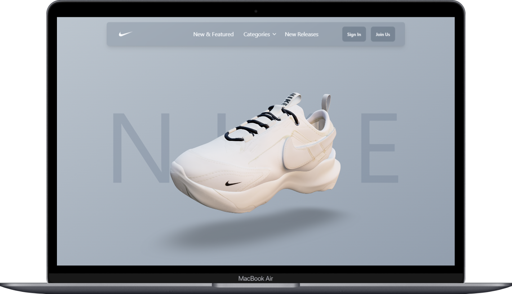

<h1 align="center">
  Project Nike 👟
</h1>

  <a href="#-layout">Layout</a>&nbsp;&nbsp;&nbsp;|&nbsp;&nbsp;&nbsp;
  <a href="#-tecnologias">Tecnologias</a>&nbsp;&nbsp;&nbsp;|&nbsp;&nbsp;&nbsp;
  <a href="#-projeto">Projeto</a>&nbsp;&nbsp;&nbsp;|&nbsp;&nbsp;&nbsp;
  <a href="#-licença">Licença</a>&nbsp;&nbsp;&nbsp;|&nbsp;&nbsp;&nbsp;
  <a href="#-contato">Contato</a>

 

## 🎨 Layout

Aqui você pode conferir o layout do projeto.  

[👉 Link para visualizar a pagina completa](https://projeto-nike.vercel.app/)

 
   

---

## 🚀 Tecnologias

Esse projeto foi desenvolvido com as seguintes tecnologias:

 
 
 
 

## 💻 Projeto

O site é uma implementação da marca <strong>Nike</strong> que apresenta o modelo de tênis <strong>Nike TC 7900</strong> em um ambiente 3D interativo. Utilizando tecnologias modernas como <strong>React Three Fiber</strong> para gráficos 3D, <strong>GSAP</strong> para animações, <strong>Tailwind</strong> CSS para estilização e <strong>DaisyUI</strong> para componentes de interface, o site oferece uma experiência envolvente e dinâmica aos usuários. Além de exibir o modelo do tênis em 3D, o site também oferece informações adicionais sobre o produto, proporcionando uma experiência completa de exploração e interação para os visitantes.

## 📝 Licença

Esse projeto está sob a licença MIT. Veja o arquivo [LICENSE](LICENSE) para mais detalhes.

## 🌐 Contato

 

---

Feito com ♥ by Gabriel Gonçalves 🖖 &nbsp;&nbsp;&nbsp;|&nbsp;&nbsp; <a href="#--exstore-">Voltar para o Inicio ⬆️ </a>